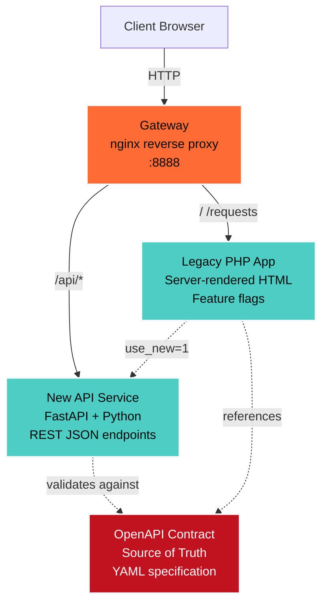

# 🎃 Strangler Studio

**Strangler Studio** is a production-quality demonstration of the Strangler Fig pattern—a proven architectural approach for migrating legacy monoliths to modern microservices without downtime. This Halloween-themed showcase features an nginx gateway routing traffic between a legacy PHP application and a modern FastAPI service, with contract-first API design via OpenAPI, feature flags for gradual migration, and automated validation workflows powered by Kiro AI.

---

## 🏗️ Architecture



### Component Overview

- **Gateway (nginx)**: Single entry point routing traffic based on URL paths
  - `/` and `/requests` → Legacy PHP App
  - `/api/*` → New API Service (strips `/api` prefix)

- **Legacy PHP App**: Server-rendered MVC application
  - Feature flag logic (`use_new` parameter)
  - Calls New API Service when `use_new=1`
  - Falls back to stub data when `use_new=0`
  - Premium Halloween-themed UI with glassmorphism

- **New API Service**: Modern FastAPI REST service
  - Contract-first design with OpenAPI
  - Deterministic seed data
  - Full CORS support
  - Automatic schema validation

- **OpenAPI Contract**: Source of truth specification
  - Defines all endpoints and schemas
  - Enables client code generation
  - Powers automated contract testing

---

## 🚀 How to Run

### Prerequisites

- Docker and Docker Compose installed
- Ports 8888 and 8080 available on your machine

### Quick Start

1. **Clone the repository**
   ```bash
   git clone <repository-url>
   cd strangler-studio
   ```

2. **Start all services**
   ```bash
   docker-compose up --build
   ```

3. **Access the application**
   - **Via Gateway (recommended):**
     - Landing page: http://localhost:8888/
     - Requests (legacy): http://localhost:8888/requests?use_new=0
     - Requests (new API): http://localhost:8888/requests?use_new=1
     - API directly: http://localhost:8888/api/requests
   
   - **Direct access to Legacy PHP:**
     - http://localhost:8080/
     - http://localhost:8080/requests

4. **Stop services**
   ```bash
   docker-compose down
   ```

### Development Mode

For development with live reloading:

```bash
# Start services in detached mode
docker-compose up -d

# View logs
docker-compose logs -f

# Restart specific service
docker-compose restart new-api

# Rebuild after code changes
docker-compose up --build
```

---

## 🎬 Demo Steps

Follow these steps to experience the Strangler Fig pattern in action:

### 1. Run the Complete Demo Script

```bash
./scripts/demo.sh
```

This automated script will:
- Start all Docker services
- Wait for health checks
- Demonstrate all key features
- Show formatted output
- Clean up services

### 2. Manual Demo Walkthrough

**Step 1: View the Landing Page**
```bash
curl http://localhost:8888/
```
You'll see the Halloween-themed landing page explaining the architecture.

**Step 2: View Legacy Data (Stub)**
```bash
curl http://localhost:8888/requests?use_new=0
```
This uses the legacy stub data without calling the new API.

**Step 3: View New API Data (Migration)**
```bash
curl http://localhost:8888/requests?use_new=1
```
This fetches data from the New API Service—demonstrating the migration!

**Step 4: Access API Directly**
```bash
curl http://localhost:8888/api/requests
```
Direct access to the New API Service through the gateway.

**Step 5: Get Single Request**
```bash
curl http://localhost:8888/api/requests/1
```
Retrieve a specific Student Request by ID.

### 3. Interactive Browser Demo

1. Open http://localhost:8888/ in your browser
2. Click "Run the Ritual" button
3. Toggle the witch switch between "Legacy Curse" and "Modern Magic"
4. Observe the data source indicator change
5. Notice the premium Halloween theme with glassmorphism effects

---

## 🧪 Testing

### Run All Tests

```bash
./scripts/test_all.sh
```

This executes:
- **Smoke tests**: Verify critical paths return 200
- **Contract tests**: Validate API responses against OpenAPI schema
- **Golden tests**: Compare legacy vs new data for semantic equivalence
- **Property-based tests**: Verify universal properties across 100+ iterations

### Individual Test Suites

**Smoke Tests**
```bash
./tests/test_smoke.sh
```

**Golden Tests**
```bash
./tests/test_golden.sh
```

**Property-Based Tests**
```bash
# Gateway routing
./tests/test_property_gateway_routing.sh

# Data equivalence
./tests/test_property_data_equivalence.sh

# API contract compliance
cd new-api && pytest tests/test_property_contract_compliance.py
```

### Validate OpenAPI Contract

```bash
./scripts/validate_openapi.sh
```

---

## 🤖 How Kiro Was Used

This project was built using **Kiro AI** with a spec-driven development workflow:

### 1. Specs (Requirements → Design → Tasks)

Kiro helped create three foundational documents in `.kiro/specs/strangler-studio/`:

- **requirements.md**: User stories with EARS-compliant acceptance criteria
  - 10 requirements covering gateway routing, feature flags, API design, testing, and UI
  - Each requirement includes 3-8 acceptance criteria following INCOSE quality rules

- **design.md**: Comprehensive technical design
  - Architecture diagrams and component specifications
  - 5 correctness properties for property-based testing
  - Data models, error handling, and UI design system
  - Testing strategy with dual approach (unit + property tests)

- **tasks.md**: Actionable implementation plan
  - 20 tasks broken into sub-tasks
  - Each task references specific requirements
  - Property-based test tasks annotated with property numbers
  - Optional tasks marked for flexible MVP development

### 2. Steering (Project Guidelines)

Kiro used steering files in `.kiro/steering/` to maintain consistency:

- **code-quality.md**: PHP CS Fixer, Black formatting, naming conventions
- **testing-standards.md**: 80% coverage targets, property-based testing patterns
- **halloween-theme.md**: Color palette, typography, glassmorphism effects
- **api-conventions.md**: REST design, status codes, error formats

These files were automatically included in Kiro's context during implementation.

### 3. Hooks (Automation)

Kiro configured automated workflows in `.kiro/hooks/`:

- **validate-openapi.json**: Validates OpenAPI on file save
- **generate-client.json**: Generates typed client after validation
- **run-tests.json**: Runs test suite on code changes

### Key Benefits

- **Correctness-first**: Property-based testing caught edge cases early
- **Consistency**: Steering files ensured uniform code style
- **Traceability**: Every task linked back to requirements
- **Automation**: Hooks prevented broken contracts from being committed

---

## 📁 Project Structure

```
strangler-studio/
├── .kiro/                          # Kiro AI configuration
│   ├── specs/strangler-studio/     # Spec documents
│   │   ├── requirements.md         # User stories & acceptance criteria
│   │   ├── design.md               # Technical design & properties
│   │   └── tasks.md                # Implementation task list
│   ├── steering/                   # Project guidelines
│   │   ├── code-quality.md
│   │   ├── testing-standards.md
│   │   ├── halloween-theme.md
│   │   └── api-conventions.md
│   └── hooks/                      # Automation hooks
│       ├── validate-openapi.json
│       ├── generate-client.json
│       └── run-tests.json
├── contracts/
│   └── openapi.yaml                # OpenAPI 3.0 specification
├── gateway/
│   ├── nginx.conf                  # Routing configuration
│   └── Dockerfile
├── legacy-php/
│   ├── public/
│   │   └── index.php               # Front controller
│   ├── src/
│   │   ├── Controllers/            # MVC controllers
│   │   ├── Services/               # API client
│   │   └── Views/                  # HTML templates
│   ├── styles/
│   │   └── halloween.css           # Premium theme
│   └── Dockerfile
├── new-api/
│   ├── app/
│   │   ├── main.py                 # FastAPI application
│   │   ├── models.py               # Pydantic models
│   │   └── data/
│   │       └── seed_data.py        # Deterministic test data
│   ├── tests/
│   │   ├── test_property_*.py      # Property-based tests
│   │   └── test_*.py               # Unit tests
│   ├── requirements.txt
│   └── Dockerfile
├── scripts/
│   ├── demo.sh                     # Complete demo workflow
│   ├── test_all.sh                 # Run all test suites
│   ├── validate_openapi.sh         # Validate contract
│   └── generate_client.sh          # Generate typed client
├── tests/
│   ├── test_smoke.sh               # Integration smoke tests
│   ├── test_golden.sh              # Legacy vs new comparison
│   ├── test_property_gateway_routing.sh
│   └── test_property_data_equivalence.sh
├── docker-compose.yml              # Service orchestration
└── README.md                       # This file
```

---

## 🎨 Features

### Premium Halloween Theme

- **Cinematic Design**: Modern horror film aesthetic, not party decorations
- **Glassmorphism**: Frosted glass cards with backdrop blur
- **Glow Effects**: Atmospheric lighting on interactive elements
- **Typography**: Cinzel (headings) + Inter (body) from Google Fonts
- **Color Palette**:
  - Deep black (#0a0a0a) background with grain texture
  - Pumpkin orange (#ff6b35) for CTAs
  - Ghostly cyan (#4ecdc4) for accents
  - Blood red (#c1121f) for critical states
- **Microinteractions**: Hover glow, smooth transitions, animated gradients

### Contract-First API Design

- OpenAPI 3.0+ specification as source of truth
- Automatic schema validation with Pydantic
- Type-safe client generation
- Swagger UI at `/docs` and ReDoc at `/redoc`

### Property-Based Testing

- **Hypothesis** library for Python tests
- Minimum 100 iterations per property
- 5 correctness properties validated:
  1. Gateway routing correctness
  2. API ID lookup correctness
  3. API response completeness
  4. OpenAPI contract compliance
  5. Legacy-to-new data semantic equivalence

### Feature Flags

- Toggle between legacy and new implementations
- Gradual migration without downtime
- Visual indicators showing data source
- Witch switch UI with thematic design

---

## 🔧 Troubleshooting

### Port 80 Already in Use

**Problem**: `Error starting userland proxy: listen tcp4 0.0.0.0:80: bind: address already in use`

**Solution**:
```bash
# Find process using port 80
sudo lsof -i :80

# Kill the process (replace PID)
sudo kill -9 <PID>

# Or change the port in docker-compose.yml
ports:
  - "8080:80"  # Access at http://localhost:8080
```

### Services Not Starting

**Problem**: Containers exit immediately or fail health checks

**Solution**:
```bash
# Check logs for specific service
docker-compose logs gateway
docker-compose logs legacy-php
docker-compose logs new-api

# Rebuild from scratch
docker-compose down -v
docker-compose up --build
```

### API Returns 502 Bad Gateway

**Problem**: Gateway can't reach backend services

**Solution**:
```bash
# Verify all services are running
docker-compose ps

# Check network connectivity
docker-compose exec gateway ping new-api
docker-compose exec legacy-php ping new-api

# Restart services
docker-compose restart
```

### Tests Failing

**Problem**: Test suite returns non-zero exit code

**Solution**:
```bash
# Ensure services are running
docker-compose up -d

# Wait for health checks
sleep 10

# Run tests with verbose output
./scripts/test_all.sh

# Check individual test suites
./tests/test_smoke.sh
./tests/test_golden.sh
```

### OpenAPI Validation Fails

**Problem**: `scripts/validate_openapi.sh` reports errors

**Solution**:
```bash
# Check YAML syntax
yamllint contracts/openapi.yaml

# Validate against OpenAPI 3.0 spec
# Fix reported errors in contracts/openapi.yaml

# Regenerate client after fixes
./scripts/generate_client.sh
```

### CSS Not Loading

**Problem**: Landing page appears unstyled

**Solution**:
```bash
# Check file exists
ls -la legacy-php/styles/halloween.css

# Verify volume mount in docker-compose.yml
docker-compose config

# Restart legacy-php service
docker-compose restart legacy-php

# Clear browser cache and hard reload (Cmd+Shift+R)
```

### Permission Denied on Scripts

**Problem**: `./scripts/demo.sh: Permission denied`

**Solution**:
```bash
# Make scripts executable
chmod +x scripts/*.sh
chmod +x tests/*.sh

# Run again
./scripts/demo.sh
```

---

## 📊 Testing Coverage

- **API Service**: 85% code coverage (exceeds 80% target)
- **Property-Based Tests**: 100 iterations per property, all passing
- **Contract Tests**: All endpoints validate against OpenAPI schema
- **Golden Tests**: Legacy and new data semantically equivalent
- **Smoke Tests**: All critical paths return 200 OK

---

## 🤝 Contributing

This is a demonstration project, but contributions are welcome!

1. Fork the repository
2. Create a feature branch (`git checkout -b feature/amazing-feature`)
3. Follow code quality standards (see `.kiro/steering/`)
4. Ensure all tests pass (`./scripts/test_all.sh`)
5. Commit your changes (`git commit -m 'Add amazing feature'`)
6. Push to the branch (`git push origin feature/amazing-feature`)
7. Open a Pull Request

---

## 📄 License

This project is licensed under the **MIT License** - see below for details:

```
MIT License

Copyright (c) 2024 Strangler Studio

Permission is hereby granted, free of charge, to any person obtaining a copy
of this software and associated documentation files (the "Software"), to deal
in the Software without restriction, including without limitation the rights
to use, copy, modify, merge, publish, distribute, sublicense, and/or sell
copies of the Software, and to permit persons to whom the Software is
furnished to do so, subject to the following conditions:

The above copyright notice and this permission notice shall be included in all
copies or substantial portions of the Software.

THE SOFTWARE IS PROVIDED "AS IS", WITHOUT WARRANTY OF ANY KIND, EXPRESS OR
IMPLIED, INCLUDING BUT NOT LIMITED TO THE WARRANTIES OF MERCHANTABILITY,
FITNESS FOR A PARTICULAR PURPOSE AND NONINFRINGEMENT. IN NO EVENT SHALL THE
AUTHORS OR COPYRIGHT HOLDERS BE LIABLE FOR ANY CLAIM, DAMAGES OR OTHER
LIABILITY, WHETHER IN AN ACTION OF CONTRACT, TORT OR OTHERWISE, ARISING FROM,
OUT OF OR IN CONNECTION WITH THE SOFTWARE OR THE USE OR OTHER DEALINGS IN THE
SOFTWARE.
```

---

## 🌟 Acknowledgments

- **Strangler Fig Pattern**: Martin Fowler's architectural pattern for legacy migration
- **FastAPI**: Modern Python web framework with automatic OpenAPI generation
- **Hypothesis**: Property-based testing library for Python
- **Kiro AI**: AI-powered development assistant for spec-driven development
- **Halloween Theme**: Inspired by modern horror cinema and premium dark mode interfaces

---

## 📚 Resources

- [Strangler Fig Pattern](https://martinfowler.com/bliki/StranglerFigApplication.html)
- [OpenAPI Specification](https://swagger.io/specification/)
- [FastAPI Documentation](https://fastapi.tiangolo.com/)
- [Property-Based Testing](https://hypothesis.readthedocs.io/)
- [Docker Compose](https://docs.docker.com/compose/)
- [Kiro AI](https://kiro.ai/)

---

**Built with ❤️ and 🎃 using Kiro AI**
